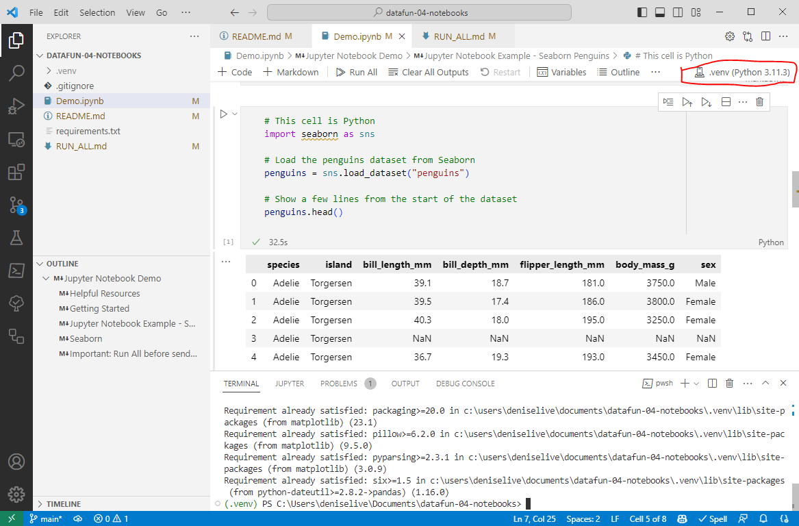

# Introduction to Jupyter Notebooks in VS Code

> datafun-04-notebooks

Jupyter Notebooks are a popular way to create and share documents for data analytics. 
They are interactive, easy to share, and support a wide variety of data science tools.

When employers ask for years of experience with a language, it's not the syntax - that can be learned in a few days. 
It's the experience with the tools, libraries, and frameworks that takes time.

## Step 1: Start Project, Open in VS Code

Start a project as usual. Create a repo in GitHub with a default README.md. 
Clone the repo down to a Projects folder on your machine. 
Open your new project repository in VS Code.
---

## Step 2: Add/Update Critical Files

With your new project repo folder open in VS Code, add/update critical project files at the start of every project. 

### Add/Add .gitignore

- The .gitignore file tells Git files to ignore when committing changes.
- Review/copy the example [.gitignore](https://github.com/denisecase/datafun-04-notebooks/blob/main/.gitignore) file, you can use it without modification.

### Add/Update requirements.txt

- The requirements.txt file lists the packages used in the project.
- Review/copy the example [requirements.txt](https://github.com/denisecase/datafun-04-notebooks/blob/main/requirements.txt) file, you can use it without modification.
- You may not use all the listed packages - and may want to add others. Modify the requirements.txt as needed.

### Update README.md

- Edit and customize your README.md to provide an overview of the project and instructions for running it. 

### Git add-commit-push

After adding .gitignore (or any other key file), run git add, commit, and push to commit your changes to GitHub. 

```shell
git add .
git commit -m "Add .gitignore"
git push -u origin main
```

---

## Step 3: Set up Virtual Environment

Next, create and activate a virtual environment for this project. 
Also install additional dependencies required for this project.
See [requirements.txt](requirements.txt) for detailed instructions. 

1. Create .venv
2. Activate .venv
3. Install dependencies into .venv

-----

## Step 4: Create a Jupyter Notebook and Create/Set Kernel

### Create a new notebook

In VS Code, from the menu, select View / Command Palette.

Type `notebook` and select `Jupyter: Create New Blank Notebook`.
This will create a new notebook in the project folder.

Save the notebook with a name like `yourname-notebook.ipynb`.

### Create a kernel from .venv

In the active virtual environment, create a Python kernel to run our notebooks. 
The following command registers the .venv virtual environment as a kernel, making it accessible in Jupyter.
Use python3 if Mac/Linux.

```shell
py -m ipykernel install --user --name .venv --display-name "Python (.venv)"
```

Verify the .venv entry appears:

```shell
jupyter kernelspec list
```

### Select the virtual environment for the notebook kernel

In VS Code, select your notebook. 
Then, from the menu, select View > Command Palette.
Type Notebook: Select Notebook Kernel.
Choose the kernel with our local "Python (.venv)" from the list.

This ensures your notebook uses the packages installed in your virtual environment.

---

## Troubleshooting

If you've created the .venv virtual environment,  installed the necessary packages, 
and selected a Kernel for your Jupyter Notebook, it should run - 
even if the code shows a missing package error. See the image below.



Why Your Notebook May Still Not See a Package

If the Jupyter notebook kernel is not set to the same environment where you installed the package, the package won't be found. This can happen if:

- The terminal in VS Code is pointed to one virtual environment, but the Jupyter kernel is using another. This can occur if you have multiple virtual environments and accidentally select the wrong one for your Jupyter notebook.
- Even if you try to manually point the kernel to the right environment, there might be path conflicts or misconfigurations that prevent the notebook from recognizing the installed packages.

### Recommendations

#### Recommendation 1: Keep Virtual Environment and Kernel Aligned

The environment where the Jupyter server runs (where a !pip install in your notebook would install packages) might differ from the environment where the notebook kernel runs. 
This can lead to scenarios where a package appears installed in the terminal but isn't accessible within the notebook.
Whenever you create a new virtual environment and want to use it with Jupyter notebooks, you need to install ipykernel and your necessary packages in that environment.

#### Recommendation 2: Use Magic Commands (Jupyter commands use %)

Once your project virtual environment and kernel are aligned, if you still have issues, then use magic commands. 
Magic commands are interpreted by the IPython kernel and provide a way to interact with the underlying Python environment directly. 
Using %pip install ensures that the package is installed in the same environment as the notebook kernel. 
To use a magic command, in your Jupyter Notebook, add a Python cell with the install command, for example:

```python
%pip install pandas
```

Note that we don't use the leading py -m that we do when running Python utility commands (pip, venv, etc.) in the terminal. 

Virtual environments are recommended to ensure isolation and reproducibility of your project's dependencies. 
If you encounter issues with virtual environments and need to install packages directly within a notebook, using magic commands is a reliable alternative.

#### Avoid: Shell Commands for Installs (Shell Commands use !)

Don't use !pip install (with an exclamation instead of percent). 
This is a shell command, which means it runs in the shell environment of the system where the Jupyter server is running. 
While it can work, it might not install the package in the same environment that the notebook kernel is using, especially in environments with multiple Python installations or virtual environments.


---

## Optional: Explore More

### Numpy and pandas

These are key libraries for data analysis. 
Pandas is built on NumPy arrays. 
Pandas has some new competitors in big data - you might check out polars. 

### Matplotlib

Matplotlib is the core plotting library for Python. 
If you enjoy data visualization and want to excel, spend some time understanding this key library. 

### Seaborn Charts

Do a search for Seaborn Gallery to see examples of charts you can create with Seaborn.
Seaborn is a Python data visualization library based on matplotlib. 
It provides a high-level interface for drawing attractive and informative statistical graphics.

### Creating Interactive Widgets with ipywidgets

Learn more about adding interactivity to your notebooks with https://ipywidgets.readthedocs.io/.

### More Helpful Resources
We'll introduce a lot of powerful tools. Find the ones that interest you and explore them further.
- [Project Jupyter](https://jupyter.org/)
- [The Jupyter Notebook (Official Documentation)](https://jupyter-notebook.readthedocs.io/en/stable/)
- [Jupyter Notebook Tips, Tricks, and Shortcuts](https://www.dataquest.io/blog/jupyter-notebook-tips-tricks-shortcuts/) - A blog post with useful tips, tricks, and keyboard shortcuts to enhance your productivity in Jupyter Notebooks.
- [Real Python Jupyter Notebook Tutorial](https://realpython.com/jupyter-notebook-introduction/) - A beginner-friendly tutorial that provides an introduction to Jupyter Notebooks, covering installation, notebook interface, running code, markdown cells, and data visualization.
- [Jupyter Notebook Cheat Sheet](https://cheatography.com/sschaub/cheat-sheets/jupyter-notebook/) - A concise cheat sheet with commonly used commands and shortcuts for Jupyter Notebooks.

### Jupyter Shortcut Keys

- Shift + Enter: Run the current cell and move to the next one.
- Ctrl + Enter: Run the current cell without moving.
- A: Insert a new cell above.
- B: Insert a new cell below.
